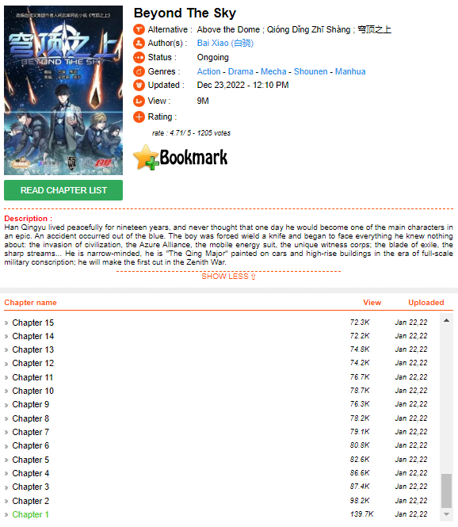
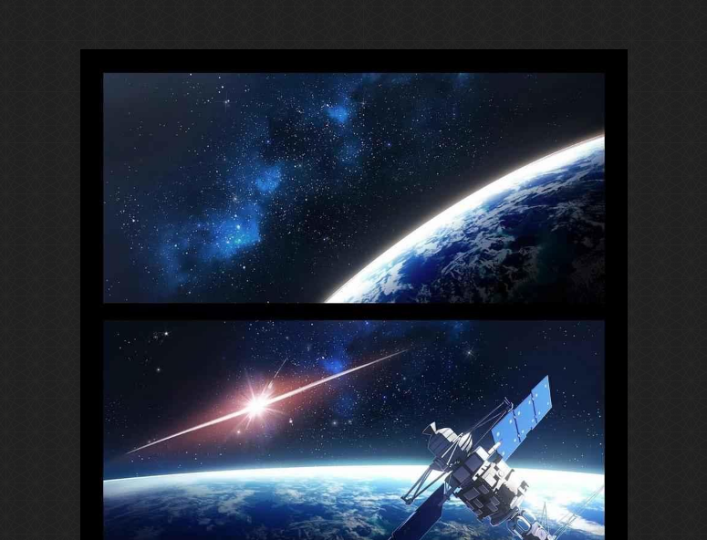

# Manga Downloader with Web Scrapping!
There are free options to read manga online, but in some of them, we aren't able to download 
a PDF version of it to read it later. This is the case of manganelo.tv (https://ww5.manganelo.tv/), 
where we can just read manga in the page from images loading in the web page.

These are manga's examples you can find in Manganelo:
* "*Beyond The Sky*": https://ww5.manganelo.tv/manga/manga-ne990439.
* "*My Wife Is A Fox Spirit*": https://ww5.manganelo.tv/manga/manga-hr984452.
* "*Fight Class 3*": https://ww5.manganelo.tv/manga/manga-cd980038.

Inside every manga's page, we have acces to the list of chapters and their information, 
as we can see in the next screeshot from the "Beyond The Sky"'s page:  

And, inside a chapter's page we can see the images:  

## 02 - Objective
* Build a program to download an specific number of chapters for an asked manga.
* The program will let the user to search any manga, and choose between the available options.
* After that, it has to shows the list of chapters to ask for the available chapters.
* The user can select one or more chapters.
* Later, the program will provide download links for the PDF version of chapters.
* It has to be deployed on streamlit for the UI.
    
## 03 - Result
You can access to the downloader by the next streamlit cloud link:
* **[Manga Downloader](https://fcocervantesrdz-mangadownload.streamlit.app/Manga_Downloader)** 

Please, feel free to download any manga and, if you want, send me feedback or recomendations:
* 🟦 *LinkedIn*: [@FcoCervantesRdz](https://www.linkedin.com/in/fcocervantesrdz/)
* 📧 *Mail*: [fco.cervantesrdz@gmail.com](mailto:fco.cervantesrdz@gmail.com)
* ⚙  *Github*: [FcoCervantesRdz](https://github.com/FcoCervantesRdz)

